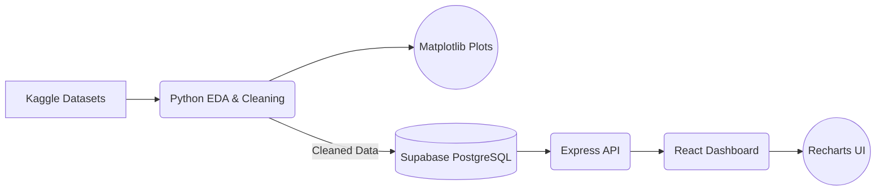

# Bengaluru Cost Explorer


An interactive, data-driven web application for exploring the cost of living trends across Bengaluru, Karnataka. The project utilizes a React dashboard and Express API to analyze crowdsourced-style cost data alongside local datasets. It features neighborhood filters, a lifestyle calculator, restaurant search, and real-estate browsing to calculate lifestyle correlations and provide actionable insights for residents and students.


## Tech Stack

- React 18 + TypeScript
- Vite
- Tailwind CSS + shadcn/ui components
- React Router
- Recharts
- Express API server
- Supabase client integration for contributed cost items

## Features

- Dashboard with cost summaries, category charts, recent contributions, and draggable widgets
- Neighborhood filtering for cost data
- Restaurant explorer backed by the local Zomato dataset
- Real-estate explorer backed by the local house prices dataset
- Lifestyle calculator for estimating monthly expenses
- Analytics and area comparison pages

## Project Structure

```text
src/                  React app source
src/components/       Shared UI and dashboard components
src/pages/            Route-level pages
src/integrations/     Supabase client and generated types
server/               Express API endpoints
public/               Static public assets
supabase/             Supabase project files and migrations
```

## Data Flow Architecture

The project is structured with a clear separation between offline data engineering and the live web application:



### Visualization Strategy

- **Matplotlib (Jupyter Notebook):** Used for offline data processing, data cleaning, initial exploratory data analysis (EDA), and validating data distributions.
- **Recharts (React):** Used for the dynamic, interactive visualizations on the frontend dashboard where users can filter by neighborhood and explore the data.

## Environment Variables

Copy `.env.example` to `.env` and fill in local values:

```bash
cp .env.example .env
```

Required variables:

```text
NODE_ENV=development
FRONTEND_URL=http://localhost:8080
VITE_API_URL=http://localhost:3001/api
PORT=3001
SUPABASE_URL=your_supabase_project_url
SUPABASE_SERVICE_ROLE_KEY=your_supabase_service_role_key
VITE_SUPABASE_URL=your_supabase_project_url
VITE_SUPABASE_ANON_KEY=your_supabase_anon_key
```

## How to Run

### 1. Database Setup (Supabase)

Ensure your `.env` is configured, then push the committed database migrations to your Supabase instance to set up the schema:

```bash
supabase db push
```

### 2. Data Pipeline (Python)

If you wish to run the exploratory data analysis and data loading pipeline:

```bash
# On Windows, you may need to set the execution policy to run the activation script
Set-ExecutionPolicy Unrestricted -Scope CurrentUser -Force

# Create and activate a virtual environment
python -m venv .venv
.\.venv\Scripts\Activate.ps1

# Upgrade pip
python.exe -m pip install --upgrade pip

# Install Python dependencies
pip install -r requirements.txt

# Start Jupyter Notebook
jupyter notebook notebooks/eda_bengaluru.ipynb
```

### 3. Web Application (Node.js)

Install JavaScript dependencies for both the frontend and the Express backend:

```bash
npm install
```

Run the frontend and API server concurrently:

```bash
npm run dev
```

The Vite app runs on `http://localhost:8080` and proxies `/api/*` requests to the Express server running on `http://localhost:3001`.

## API Endpoints

The Express backend provides the following endpoints:

- `GET /api/restaurants`
  - **Description**: Returns a paginated list of restaurant data.
  - **Query Parameters**:
    - `area` (optional): Filter restaurants by location.
    - `limit` (optional): Number of items per page (default: 50).
    - `page` (optional): Page number (default: 1).

- `GET /api/real-estate`
  - **Description**: Returns a paginated list of real-estate properties.
  - **Query Parameters**:
    - `area` (optional): Filter properties by location.
    - `limit` (optional): Number of items per page (default: 50).
    - `page` (optional): Page number (default: 1).

## Data Sets and Sources

This is where we got the data sets and sources:

- [99acres Bengaluru Dataset](https://www.kaggle.com/datasets/rohan2662/99acres-bengaluru-dataset)
- [House Prices Bangalore 2025](https://www.kaggle.com/datasets/sydsxdiq/house-prices-bangalore2025?hl=en-US)
- [Zomato Bangalore Dataset](https://www.kaggle.com/datasets/absin7/zomato-bangalore-dataset?hl=en-US)
- [Cost of Living in Bangalore](https://www.numbeo.com/cost-of-living/in/Bangalore?hl=en-US)
- [OpenCity Data](https://data.opencity.in/?hl=en-US)

## Team Members

**College**: K.S. School of Engineering and Management

- **[Pranav](https://github.com/toxicbishop)** - 1KG23CB038 (Lead Developer / Data Analyst)
- **[Rohith R.](https://github.com/Rohithgaloth)** - 1KG23CB044 (Documentation & Analysis)
- **[Supreeth](https://github.com/supr1795)** - 1KG23CB051 (Visualization & Reporting)
- **[Syed](https://github.com/Mohammed0572)** - 1KG23CB052 (Data Collection & Research)

## Contribution

This was a collaborative academic project. If you wish to improve the data or add new parameters (e.g., Inflation rates), feel free to fork the repo and submit a Pull Request!

<div align="center">
  &copy; 2025 K.S. School of Engineering and Management Group Project
</div>
