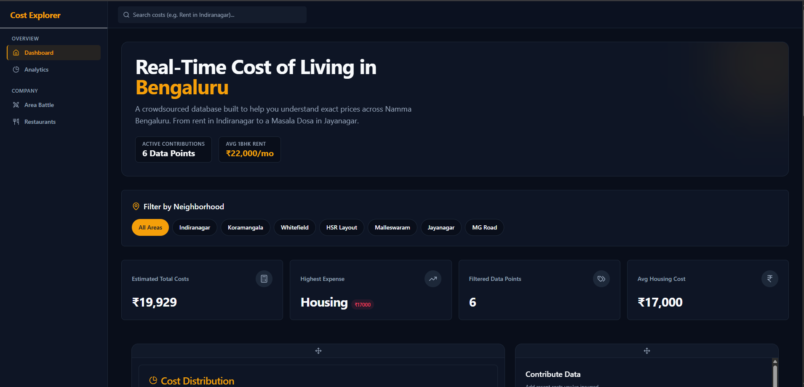

# Bengaluru Cost Explorer


A data-driven analysis project examining the cost of living trends in Bengaluru, Karnataka. This project utilizes a React dashboard, Express API, and DuckDB to visualize expenses, calculate correlations between lifestyle factors, and provide actionable insights for residents and students.

An interactive web application for exploring cost-of-living signals across Bengaluru. The app combines crowdsourced-style cost data, neighborhood filters, charts, a lifestyle calculator, restaurant search, real-estate browsing, and a 3D category breakdown.



## Tech Stack

- React 18 + TypeScript
- Vite
- Tailwind CSS + shadcn/ui components
- React Router
- Recharts and Three.js
- Express API server
- DuckDB for querying local CSV datasets
- Supabase client integration for contributed cost items

## Features

- Dashboard with cost summaries, category charts, recent contributions, and draggable widgets
- Interactive 3D category breakdown with click-to-filter behavior
- Neighborhood filtering for cost data
- Restaurant explorer backed by the local Zomato CSV dataset
- Real-estate explorer backed by the local house prices CSV dataset
- Lifestyle calculator for estimating monthly expenses
- Analytics and area comparison pages

## Project Structure

```text
src/                  React app source
src/components/       Shared UI and dashboard components
src/pages/            Route-level pages
src/integrations/     Supabase client and generated types
server/               Express API and CSV query endpoints
csv/                  Local datasets used by DuckDB
public/               Static public assets
supabase/             Supabase project files and migrations
```

## Environment Variables

Copy `.env.example` to `.env` and fill in local values:

```bash
cp .env.example .env
```

Required variables:

```text
NODE_ENV=development
FRONTEND_URL=http://localhost:8080
VITE_API_URL=http://localhost:3001/api
PORT=3001
SUPABASE_URL=your_supabase_project_url
SUPABASE_SERVICE_ROLE_KEY=your_supabase_service_role_key
VITE_SUPABASE_URL=your_supabase_project_url
VITE_SUPABASE_ANON_KEY=your_supabase_anon_key
```

## Local Development

Install dependencies:

```bash
npm install
```

Run the frontend and API server together:

```bash
npm run dev
```

The Vite app runs on:

```text
http://localhost:8080
```

The Express API runs on:

```text
http://localhost:3001
```

Vite proxies `/api/*` requests to the Express server.

## Data Sets and Sources

This is where we got the data sets and sources:

- [99acres Bengaluru Dataset](https://www.kaggle.com/datasets/rohan2662/99acres-bengaluru-dataset)
- [House Prices Bangalore 2025](https://www.kaggle.com/datasets/sydsxdiq/house-prices-bangalore2025?hl=en-US)
- [Zomato Bangalore Dataset](https://www.kaggle.com/datasets/absin7/zomato-bangalore-dataset?hl=en-US)
- [Cost of Living in Bangalore](https://www.numbeo.com/cost-of-living/in/Bangalore?hl=en-US)
- [OpenCity Data](https://data.opencity.in/?hl=en-US)

## Team Members

**College**: K.S. School of Engineering and Management

- **[Pranav](https://github.com/toxicbishop)** - 1KG23CB038 (Lead Developer / Data Analyst)
- **[Rohith R.](https://github.com/Rohithgaloth)** - 1KG23CB044 (Documentation & Analysis)
- **[Supreeth](https://github.com/supr1795)** - 1KG23CB051 (Visualization & Reporting)
- **[Syed](https://github.com/Mohammed0572)** - 1KG23CB052 (Data Collection & Research)

## Contribution

This was a collaborative academic project. If you wish to improve the data or add new parameters (e.g., Inflation rates), feel free to fork the repo and submit a Pull Request!

<div align="center">
  &copy; 2025 K.S. School of Engineering and Management Group Project
</div>
